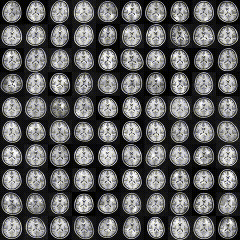
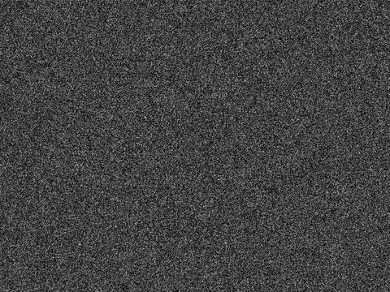
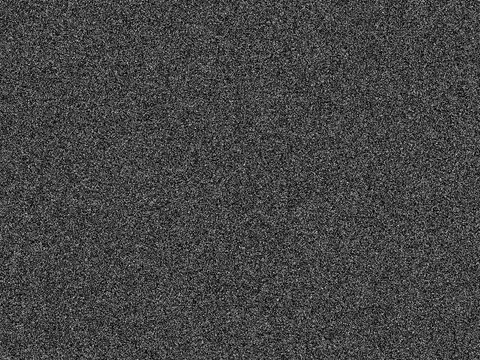
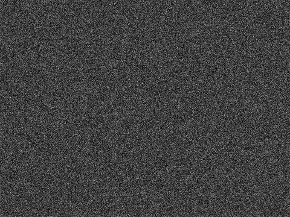

## Deep Computational Anatomy via Latent-Aligned Multiview Normalizing Flows


----

Latent-aligned multiview normalizing (LAMNr) flows leverage exact-likelihood, bijective mappings to learn shared latent subspaces across heterogeneous, multimodal datasets. By applying formal latent-alignment constraints, the framework topologically unfolds anatomical manifolds into continuous vector spaces, enabling principled interpretations of computational anatomy concepts, such as population templates and geodesic interpolation. Evaluated on tabular IDPs and multimodal MRI, LAMNr flows improve calibrated likelihoods and downstream predictions compared to linear baselines. 


***

### RealNVP-based LAMNr flows 

<details>
<summary>Network architecture</summary>


              RealNVP flow with alternative base distributions
              =================================================

                      +------------------------+
                      |       Input x          |
                      |        [B, D]          |
                      +------------------------+
                                   |
                                   v
                      +------------------------+
                      |  RealNVP block stack   |
                      |  K coupling steps      |
                      +------------------------+
                                   |
                                   v
                      +------------------------+
                      |      Latent z_K        |
                      |        [B, D]          |
                      +------------------------+
                          /               \
                         /                 \
                        v                   v

        +--------------------------------+      +-------------------------------------------+
        |     DiagGaussian base          |      |          GaussianPCA base                |
        |                                |      |                                           |
        |   z_K ~ N(0, I_D)              |      |   z_K ~ N(μ, W Wᵀ + σ² I_D)              |
        |                                |      |   u ~ N(0, I_M),  ε ~ N(0, I_D)          |
        |   (isotropic / diagonal        |      |   z_K = μ + W u + σ ε                    |
        |    Gaussian prior)             |      |   (low-rank + isotropic residual)        |
        +--------------------------------+      +-------------------------------------------+

              Same RealNVP encoder; only the base density p(z_K) differs.

</details>

<details>
<summary>Single view, uniform --> diagonal Gaussian (toy example)</summary>

<p align="center">
  <br>
  Input<br>        
  <br>
  Output
</p>

</details>

<details>
<summary>Multi-view NNHEmbed</summary>
  
Data from [*Joint representations from multi-view MRI-based learning support cognitive and functional performance domains*](https://www.medrxiv.org/content/10.1101/2025.09.27.25336706v2)

<p align="center">
  
</p>

The forest plot illustrates the correlation uplift ($\Delta r$)
across two levels of comparison: (1) the gain from non-linear manifold
mapping, represented by the difference between LAMNr flows (with VICReg) and
the SiMLR baseline (i.e., red intervals), and (2) the gain from latent
alignment, represented by the difference between the aligned LAMNr model and
an unconstrained multi-view baseline ($\lambda = 0$, i.e., blue intervals).
Error bars represent the 95\% confidence intervals derived from 1000
bootstrap resamples. Top panel displays results for the NNL cohort, showing
significant non-linear gains in memory and executive function. Bottom panel
displays results for the PPMI cohort, where linear models remain highly
competitive. Significant improvements ($q < 0.05$, FDR corrected) are
indicated by intervals that do not cross the zero-reference line.

</details>

***

### Glow-based LAMNr flows

<details>
<summary>Network architecture/configuration</summary>

__Single view normalizing flow__

```python
Input (image space)
-------------------
x : [B, 1, 128, 128]

          |
          | SQUEEZE (×4 channels, /2 spatial)
          v

Level 0 feature map
-------------------
h0: [B, 4, 64, 64]
    |
    | Glow blocks (K steps, invertible)
    v
    SPLIT (factor-out half the channels)
    +-----------------------------> z0: [B, 2, 64, 64]   (latent level 0)
    |
    +--> h1: [B, 2, 64, 64]  (remaining, goes deeper)

          |
          | SQUEEZE
          v

Level 1 feature map
-------------------
h1s: [B, 8, 32, 32]
     |
     | Glow blocks
     v
     SPLIT
     +----------------------------> z1: [B, 4, 32, 32]   (latent level 1)
     |
     +--> h2: [B, 4, 32, 32]

          |
          | SQUEEZE
          v

Level 2 feature map
-------------------
h2s: [B, 16, 16, 16]
     |
     | Glow blocks
     v
     SPLIT
     +----------------------------> z2: [B, 8, 16, 16]   (latent level 2)
     |
     +--> h3: [B, 8, 16, 16]

          |
          | SQUEEZE
          v

Level 3 feature map
-------------------
h3s: [B, 32, 8, 8]
     |
     | Glow blocks
     v
     SPLIT
     +----------------------------> z3: [B, 16, 8, 8]    (latent level 3)
     |
     +--> h4: [B, 16, 8, 8]

          |
          | SQUEEZE  (last time, because L=5)
          v

Level 4 (bottom level)
----------------------
h4s ≡ z4: [B, 64, 4, 4]          (latent level 4, NO split here)

All latents:
------------
z = { z0, z1, z2, z3, z4 }
```
__Latent-aligned multiview__

```python
                Latent-Aligned Multiview Normalizing Flows
                ==========================================

   x^(1) (T1)           x^(2) (T2)           x^(3) (FA)
 [B,1,128,128]        [B,1,128,128]        [B,1,128,128]
       |                     |                     |
       v                     v                     v
   +----------+          +----------+          +----------+
   |  Flow f1 |          |  Flow f2 |          |  Flow f3 |
   | (Glow,   |          | (Glow,   |          | (Glow,   |
   |  L = 5)  |          |  L = 5)  |          |  L = 5)  |
   +----------+          +----------+          +----------+
       |                     |                     |
       | z^(1) = {z_0..z_4}  | z^(2) = {z_0..z_4}  | z^(3) = {z_0..z_4}
       | (per-level latents) | (per-level latents) | (per-level latents)
       +----------+----------+----------+----------+
                  |                     |
                  v                     v

          +---------------------------------------------+
          |  Per-level alignment + Gaussian head        |
          |                                             |
          |  For ℓ = 0..4:                              |
          |    { z_ℓ^(v) }_(v=1..3)  ─→  projectors     |
          |                            ─→  alignment    |
          |    NLL from each flow     ─→  joint loss    |
          +---------------------------------------------+
```
</details>

<details>
<summary>Data augmentation:  (HCP-YA T1w template example)</summary>

```bash
iterations=100000
aug_params="noise_std:cos:0.05->0.015@${iterations},\
            sd_affine:cos:0.05->0.01@${iterations},\
            sd_deformation:linear:12.0->0.6@${iterations},\
            sd_simulated_bias_field:cos:0.20->0.03@${iterations},\
            sd_histogram_warping:cos:0.04->0.008@${iterations}"
```
Visualization cycle (~20 seconds)


</details>

<details>
<summary>Training LAMNr flows model (2D, 3 views)</summary>

* [OpenNeuro data](https://openneuro.org/datasets/ds004856) 
* [Command script](https://github.com/ntustison/LAMNrFlows/blob/main/Examples/lamnr_glow_dlbs/command_train_lamnr_glow_2d_t1_t2flair_fa_whole_head.sh)
* [Trainer](https://github.com/ntustison/LAMNrFlows/blob/main/Examples/lamnr_glow_dlbs/train_lamnr_glow_2d.py)





</details>


<!--

<details>
<summary>Multimodal brain lifespan data with augmentation</summary>


</details>


<details>
<summary>Output:  Generative sampling</summary>

  
</details>

<details>
<summary>Output:  Fréchet mean approximation</summary>

  
</details>

<details>
<summary>Output:  Cohort template</summary>

  
</details>

<details>
<summary>Output:  Latent distances for biological assesment</summary>

  
</details>

<details>
<summary>Output:  Cross-modal imputation via Conditional Gaussian modeling.</summary>

  
</details>

<details>
<summary>Output:  Pairwise image interpolation.</summary>

  
</details>

<details>
<summary>Output:  Temperature scaling.</summary>

  
</details>
-->

***

### Funding support

We gratefully acknowledge the grant support of the Office of Naval Research (N0014-23-1-2317)
and the National Institute of Biomedical Imaging and Bioengineering (R01-EB031722).  
  

