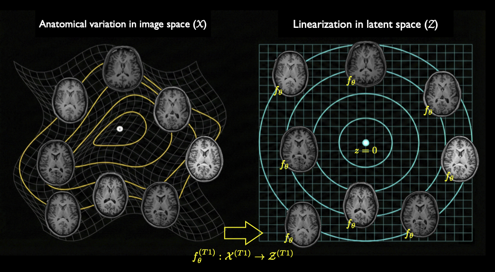
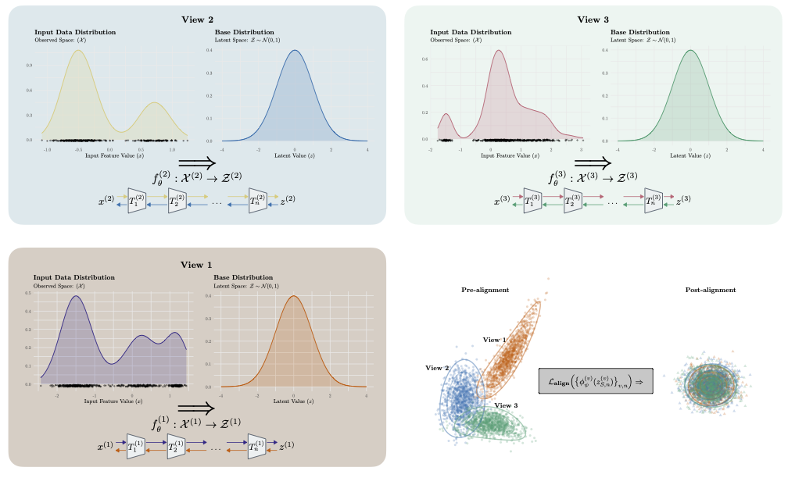
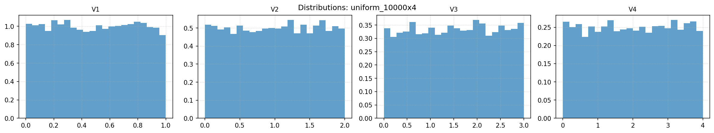
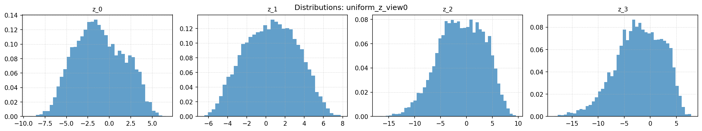
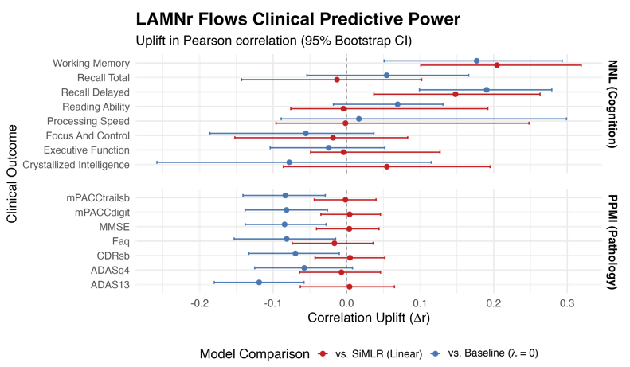

## Deep Computational Anatomy via Latent-Aligned Multiview Normalizing Flows



----

Latent-aligned multiview normalizing (LAMNr) flows leverage exact-likelihood, bijective mappings to learn shared latent subspaces across heterogeneous, multimodal datasets. By applying formal latent-alignment constraints, the framework topologically unfolds anatomical manifolds into continuous vector spaces, enabling principled interpretations of computational anatomy concepts, such as population templates and geodesic interpolation. Evaluated on tabular IDPs and multimodal MRI, LAMNr flows improve calibrated likelihoods and downstream predictions compared to linear baselines. 


***

### RealNVP (tabular data)

<details>
<summary>Network architecture</summary>


              RealNVP flow with alternative base distributions
              =================================================

                      +------------------------+
                      |       Input x          |
                      |        [B, D]          |
                      +------------------------+
                                   |
                                   v
                      +------------------------+
                      |  RealNVP block stack   |
                      |  K coupling steps      |
                      +------------------------+
                                   |
                                   v
                      +------------------------+
                      |      Latent z_K        |
                      |        [B, D]          |
                      +------------------------+
                          /               \
                         /                 \
                        v                   v

        +--------------------------------+      +-------------------------------------------+
        |     DiagGaussian base          |      |          GaussianPCA base                |
        |                                |      |                                           |
        |   z_K ~ N(0, I_D)              |      |   z_K ~ N(μ, W Wᵀ + σ² I_D)              |
        |                                |      |   u ~ N(0, I_M),  ε ~ N(0, I_D)          |
        |   (isotropic / diagonal        |      |   z_K = μ + W u + σ ε                    |
        |    Gaussian prior)             |      |   (low-rank + isotropic residual)        |
        +--------------------------------+      +-------------------------------------------+

              Same RealNVP encoder; only the base density p(z_K) differs.

</details>

<details>
<summary>Single view, uniform --> diagonal Gaussian (toy example)</summary>

<p align="center">
  <br>
  Input<br>        
  <br>
  Output
</p>

</details>

<details>
<summary>Multi-view NNHEmbed</summary>
  
[Data from *Joint representations from multi-view MRI-based learning support cognitive and functional performance domains*]([https://www.nature.com/articles/s41598-024-59440-6](https://www.medrxiv.org/content/10.1101/2025.09.27.25336706v2)

<p align="center">
  
</p>
</details>

***

### Glow-based 2-D HCP example

<details>
<summary>Network architecture/configuration</summary>

```bash
[run] 2025-12-02 09:17:02 | Py 3.11.9 | torch 2.4.1+cu121 | cuda=true (n=2)
[note] post-dataset build
                 out_dir: runs/hcp_t1_t2_fa_128x128_vicreg_K12_H192_vicreg_screen_phase1
                   views: 3
                     H×W: 128×128
          L / K / hidden: 5 / 12 / 192
                   align: vicreg
               weighting: fixed
                   batch: 64
                max_iter: 120000
             extra_iters: 0
             lr / warmup: 0.0001 / 1000
             ema / decay: true / 0.9997
               precision: mixed
                 devices: cuda:0
               slice_idx: 116
                val_frac: 0.0
train_samples / val_samples: 3000 / 128
             num_workers: 4
                    seed: 0
            smooth_alpha: 0.05
      sample_mode / temp: model / 1.0
      disable_aug_anneal: false
           aug_schedules: noise_std:cos:0.05->0.004@160000,sd_affine:cos:0.05->0.00@96000,sd_deformation:linear:12.0->0.6@112000,sd_simulated_bias_field:cos:0.20->0.03@160000,sd_histogram_warping:cos:0.04->0.008@160000
                  screen: cca
             screen_frac: 0.5
 screen_warmup / refresh: 1000 / 0
               cca_ridge: 0.001
          prefilter_frac: 0.5
------------------------------------------------------------
          subjects_total: n/a
   train_images_list_len: 3
     val_images_list_len: 1
 effective_train_samples: 3000
   effective_val_samples: 128
              batch_size: 64
```

__Single view normalizing flow__

```python
Input (image space)
-------------------
x : [B, 1, 128, 128]

          |
          | SQUEEZE (×4 channels, /2 spatial)
          v

Level 0 feature map
-------------------
h0: [B, 4, 64, 64]
    |
    | Glow blocks (K steps, invertible)
    v
    SPLIT (factor-out half the channels)
    +-----------------------------> z0: [B, 2, 64, 64]   (latent level 0)
    |
    +--> h1: [B, 2, 64, 64]  (remaining, goes deeper)

          |
          | SQUEEZE
          v

Level 1 feature map
-------------------
h1s: [B, 8, 32, 32]
     |
     | Glow blocks
     v
     SPLIT
     +----------------------------> z1: [B, 4, 32, 32]   (latent level 1)
     |
     +--> h2: [B, 4, 32, 32]

          |
          | SQUEEZE
          v

Level 2 feature map
-------------------
h2s: [B, 16, 16, 16]
     |
     | Glow blocks
     v
     SPLIT
     +----------------------------> z2: [B, 8, 16, 16]   (latent level 2)
     |
     +--> h3: [B, 8, 16, 16]

          |
          | SQUEEZE
          v

Level 3 feature map
-------------------
h3s: [B, 32, 8, 8]
     |
     | Glow blocks
     v
     SPLIT
     +----------------------------> z3: [B, 16, 8, 8]    (latent level 3)
     |
     +--> h4: [B, 16, 8, 8]

          |
          | SQUEEZE  (last time, because L=5)
          v

Level 4 (bottom level)
----------------------
h4s ≡ z4: [B, 64, 4, 4]          (latent level 4, NO split here)

All latents:
------------
z = { z0, z1, z2, z3, z4 }
```
__Latent-aligned multiview__

```python
                Latent-Aligned Multiview Normalizing Flows
                ==========================================

   x^(1) (T1)           x^(2) (T2)           x^(3) (FA)
 [B,1,128,128]        [B,1,128,128]        [B,1,128,128]
       |                     |                     |
       v                     v                     v
   +----------+          +----------+          +----------+
   |  Flow f1 |          |  Flow f2 |          |  Flow f3 |
   | (Glow,   |          | (Glow,   |          | (Glow,   |
   |  L = 5)  |          |  L = 5)  |          |  L = 5)  |
   +----------+          +----------+          +----------+
       |                     |                     |
       | z^(1) = {z_0..z_4}  | z^(2) = {z_0..z_4}  | z^(3) = {z_0..z_4}
       | (per-level latents) | (per-level latents) | (per-level latents)
       +----------+----------+----------+----------+
                  |                     |
                  v                     v

          +---------------------------------------------+
          |  Per-level alignment + Gaussian head        |
          |                                             |
          |  For ℓ = 0..4:                              |
          |    { z_ℓ^(v) }_(v=1..3)  ─→  projectors     |
          |                            ─→  alignment    |
          |    NLL from each flow     ─→  joint loss    |
          +---------------------------------------------+
```
</details>

<details>

<summary>Input:  HCP templates (T1, T2, & FA/Young Adult, Adult, Inter) with augmentation</summary>

<p align="center">
  
  
  
</p>
  
</details>

<details>

<summary>Output:  Generative samples at 120k iterations</summary>

<p align="center">
  
  
  
</p>
  
</details>

***

### Funding support

We gratefully acknowledge the grant support of the Office of Naval Research (N0014-23-1-2317)
and the National Institute of Biomedical Imaging and Bioengineering (R01-EB031722).  
  

