## Latent-Aligned Multiview Normalizing (LAMNr) Flows

We introduce Latent-Aligned Multiview Normalizing (LAMNr) Flows, a general framework that learns a shared latent subspace across views, thereby treating the orthogonal complement as view-specific variation. Using subject-matched batches, we implement a library of latent-alignment constraints (Pearson, Barlow Twins, VICReg, InfoNCE, HSIC) and optionally use CCA (linear) or HSIC (kernel) to identify latent directions that are statistically shared across views, restricting alignment to those coordinates. After maximum-likelihood training, we model the joint latents as Gaussian, estimate per-level moments, and use the conditional Gaussian formulation to obtain closed-form posteriors for any subset. This enables principled cross-view imputation and, more generally, latent manipulations that preserve anatomy or identity while modulating modality- or view-specific factors; for images, replacing private components by their conditional means produces shared-latent images that act as contrast-robust surrogates. 

***

### RealNVP (tabular data)

<details>
<summary>Network architecture</summary>


              RealNVP flow with alternative base distributions
              =================================================

                      +------------------------+
                      |       Input x          |
                      |        [B, D]          |
                      +------------------------+
                                   |
                                   v
                      +------------------------+
                      |  RealNVP block stack   |
                      |  K coupling steps      |
                      +------------------------+
                                   |
                                   v
                      +------------------------+
                      |      Latent z_K        |
                      |        [B, D]          |
                      +------------------------+
                          /               \
                         /                 \
                        v                   v

        +--------------------------------+      +-------------------------------------------+
        |     DiagGaussian base          |      |          GaussianPCA base                |
        |                                |      |                                           |
        |   z_K ~ N(0, I_D)              |      |   z_K ~ N(μ, W Wᵀ + σ² I_D)              |
        |                                |      |   u ~ N(0, I_M),  ε ~ N(0, I_D)          |
        |   (isotropic / diagonal        |      |   z_K = μ + W u + σ ε                    |
        |    Gaussian prior)             |      |   (low-rank + isotropic residual)        |
        +--------------------------------+      +-------------------------------------------+

              Same RealNVP encoder; only the base density p(z_K) differs.

</details>

<details>
<summary>Single view, uniform --> diagonal Gaussian (toy example)</summary>

<p align="center">
  <br>
  Input<br>        
  <br>
  Output
</p>

</details>

<details>
<summary>Single view, ANTsX/FreeSurfer/FSL UKBB IDPs</summary>
  
[Data from *ANTsX neuroimaging-derived structural phenotypes of UK Biobank*](https://www.nature.com/articles/s41598-024-59440-6)

<p align="center">
  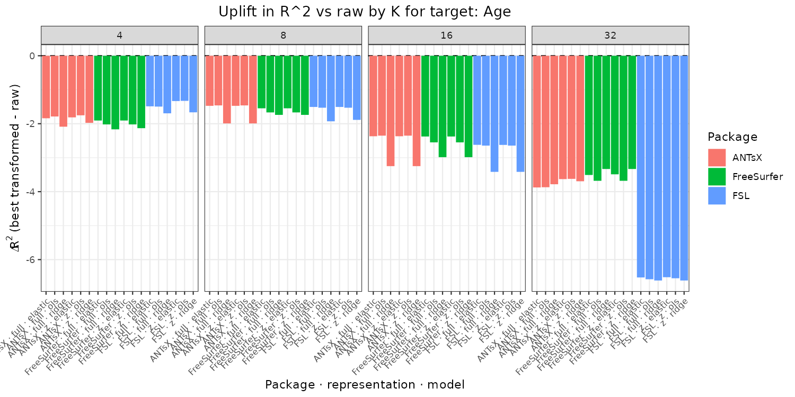<br>
  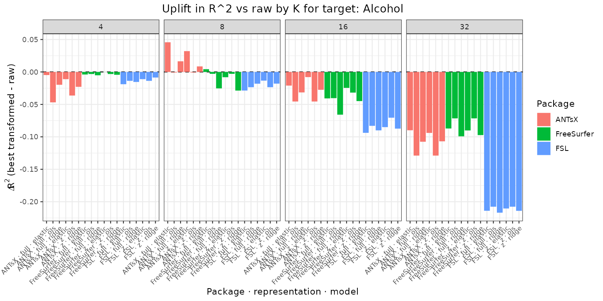<br>
  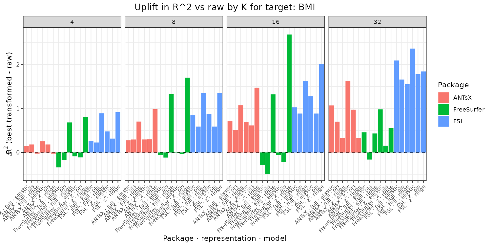<br>
  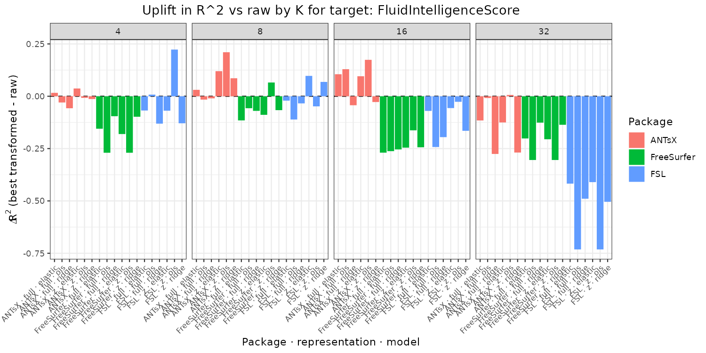<br>
  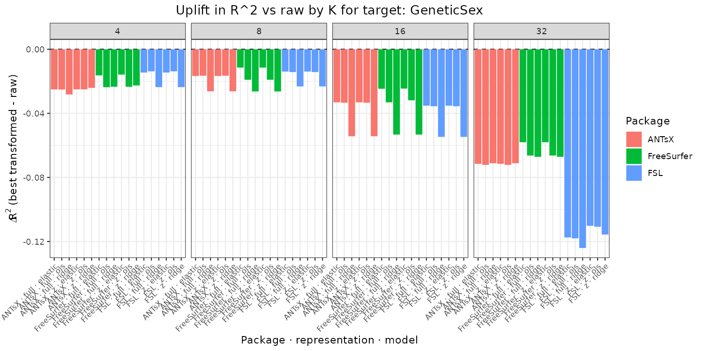<br>
  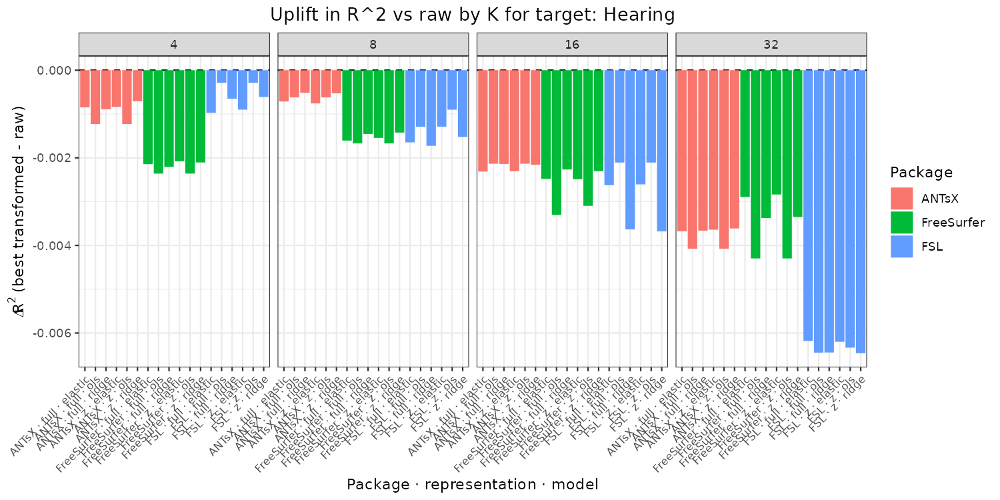<br>
  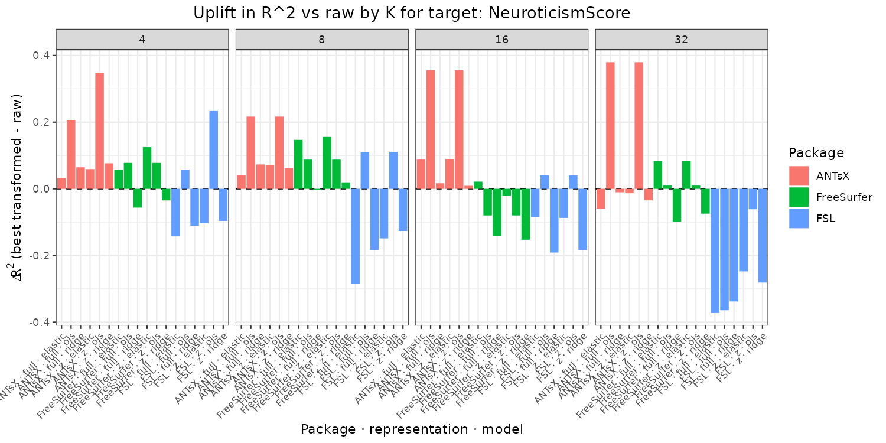<br>
  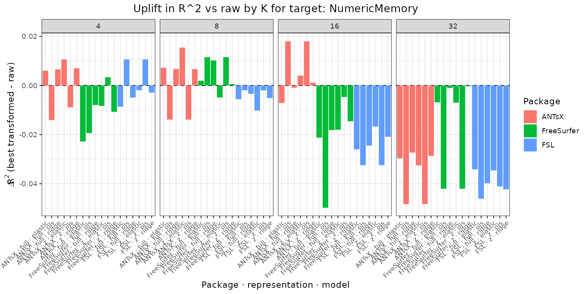<br>
  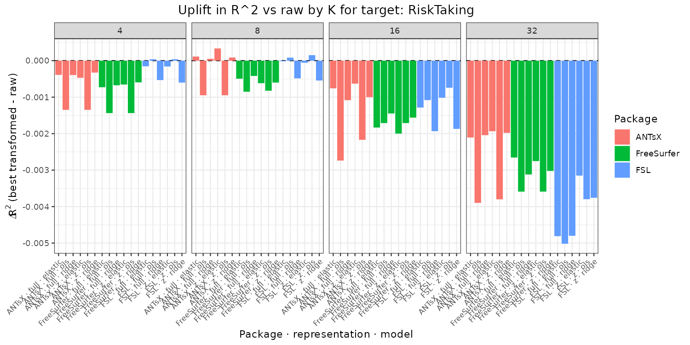<br>
  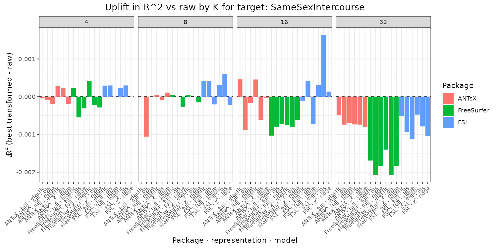<br>
  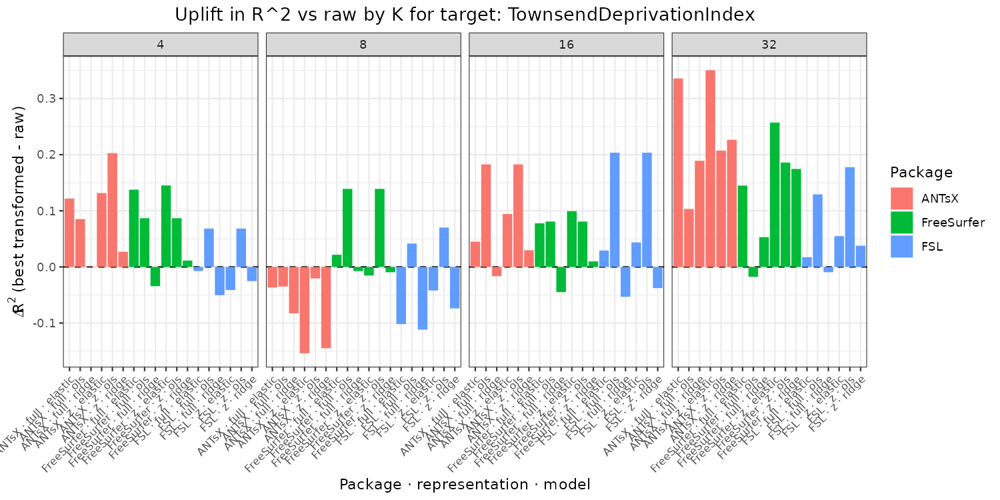<br>
</p>

</details>

***

### Glow-based 2-D HCP example

<details>
<summary>Network architecture</summary>

* input size: 128×128

* levels: L = 5

* single-channel input per view: C₀ = 1 (you can mentally replace 1 with C₀ if you want it symbolic)

* Squeeze 5 times to go from 128×128 down to 4×4.

* Split at the first 4 levels (0–3).

* The bottom level (L-1 = 4) keeps all its channels as z4.

__Single view normalizing flow__

```python
Input (image space)
-------------------
x : [B, 1, 128, 128]

          |
          | SQUEEZE (×4 channels, /2 spatial)
          v

Level 0 feature map
-------------------
h0: [B, 4, 64, 64]
    |
    | Glow blocks (K steps, invertible)
    v
    SPLIT (factor-out half the channels)
    +-----------------------------> z0: [B, 2, 64, 64]   (latent level 0)
    |
    +--> h1: [B, 2, 64, 64]  (remaining, goes deeper)

          |
          | SQUEEZE
          v

Level 1 feature map
-------------------
h1s: [B, 8, 32, 32]
     |
     | Glow blocks
     v
     SPLIT
     +----------------------------> z1: [B, 4, 32, 32]   (latent level 1)
     |
     +--> h2: [B, 4, 32, 32]

          |
          | SQUEEZE
          v

Level 2 feature map
-------------------
h2s: [B, 16, 16, 16]
     |
     | Glow blocks
     v
     SPLIT
     +----------------------------> z2: [B, 8, 16, 16]   (latent level 2)
     |
     +--> h3: [B, 8, 16, 16]

          |
          | SQUEEZE
          v

Level 3 feature map
-------------------
h3s: [B, 32, 8, 8]
     |
     | Glow blocks
     v
     SPLIT
     +----------------------------> z3: [B, 16, 8, 8]    (latent level 3)
     |
     +--> h4: [B, 16, 8, 8]

          |
          | SQUEEZE  (last time, because L=5)
          v

Level 4 (bottom level)
----------------------
h4s ≡ z4: [B, 64, 4, 4]          (latent level 4, NO split here)

All latents:
------------
z = { z0, z1, z2, z3, z4 }
```
__Latent-aligned multiview__

```python
                Latent-Aligned Multiview Normalizing Flows
                ==========================================

   x^(1) (T1)           x^(2) (T2)           x^(3) (FA)
 [B,1,128,128]        [B,1,128,128]        [B,1,128,128]
       |                     |                     |
       v                     v                     v
   +----------+          +----------+          +----------+
   |  Flow f1 |          |  Flow f2 |          |  Flow f3 |
   | (Glow,   |          | (Glow,   |          | (Glow,   |
   |  L = 5)  |          |  L = 5)  |          |  L = 5)  |
   +----------+          +----------+          +----------+
       |                     |                     |
       | z^(1) = {z_0..z_4}  | z^(2) = {z_0..z_4}  | z^(3) = {z_0..z_4}
       | (per-level latents) | (per-level latents) | (per-level latents)
       +----------+----------+----------+----------+
                  |                     |
                  v                     v

          +---------------------------------------------+
          |  Per-level alignment + Gaussian head        |
          |                                             |
          |  For ℓ = 0..4:                              |
          |    { z_ℓ^(v) }_(v=1..3)  ─→  projectors     |
          |                            ─→  alignment    |
          |    NLL from each flow     ─→  joint loss    |
          +---------------------------------------------+
```
</details>

<details>

<summary>Command call</summary>

```bash
#!/usr/bin/env bash
set -eu pipefail

# total steps
iterations=120000          # phase 1
extra=40000               # phase 2
total=$((iterations + extra))   # horizon for phase-1 aug schedule

# 128×128 high-capacity arch
H=128; W=128; L=5; K=12; hidden=192
BATCH=64
align=vicreg
align_weight=0.01
OUTDIR="runs/hcp_t1_t2_fa_${H}x${W}_${align}_K${K}_H${hidden}_${align}_screen_phase1"

# Screening configuration
SCREEN_METHOD=cca           # options: none | cca | hsic
SCREEN_FRAC=0.5             # keep top 50% dims for alignment
SCREEN_WARMUP=1000          # start screening after N iters
SCREEN_REFRESH=0            # 0 = discover once; else refresh cadence
CCA_RIDGE=1e-3              # stability for CCA
PREFILTER_FRAC=0.5          # HSIC Pearson prefilter (ignored for CCA)

# ------------------------------
# Augmentation schedules
# ------------------------------

# Phase 1: original decreasing schedule (strong -> weak)
aug_params_phase1="noise_std:cos:0.05->0.004@${total},\
sd_affine:cos:0.05->0.00@$((total*3/5)),\
sd_deformation:linear:12.0->0.6@$((total*7/10)),\
sd_simulated_bias_field:cos:0.20->0.03@${total},\
sd_histogram_warping:cos:0.04->0.008@${total}"

# Phase 2: template-focused fine-tune (no shape; mild intensity jitter)
aug_params_phase2="noise_std:cos:0.004->0.004@${extra},\
sd_affine:cos:0.00->0.00@${extra},\
sd_deformation:linear:0.0->0.0@${extra},\
sd_simulated_bias_field:cos:0.00->0.00@${extra},\
sd_histogram_warping:cos:0.008->0.008@${extra}"

SLICE_IDX=116

# ---- Phase 1: strong->weak aug (as in earlier successful runs) ----
python train_cohort_screened.py \
  --view ~/Data/HCPTemplates/*/T_template0.nii.gz \
  --view ~/Data/HCPTemplates/*/T_template1.nii.gz \
  --view ~/Data/HCPTemplates/*/T_template2.nii.gz \
  --H ${H} --W ${W} --L ${L} --K ${K} --hidden ${hidden} \
  --batch ${BATCH} \
  --slice-idx ${SLICE_IDX} --val-frac 0.0 \
  --max-iter "${iterations}" \
  --devices cuda:1 --precision mixed --amp-dtype bf16 \
  --ema --ema-decay 0.9997 \
  --auto-resume \
  --aug-schedules "${aug_params_phase1}" \
  --lr 1e-4 --warmup-iters 1000 \
  --eval-interval 1000 --plot-interval 1000 \
  --grad-clip 1.0 \
  --train-samples 3000 --val-samples 128 \
  --smooth-alpha 0.05 \
  --sample-mode model \
  --weighting fixed \
  --align "${align}" \
  --align-weight "${align_weight}" \
  --screen "${SCREEN_METHOD}" \
  --screen-warmup "${SCREEN_WARMUP}" \
  --screen-refresh "${SCREEN_REFRESH}" \
  --screen-frac "${SCREEN_FRAC}" \
  --cca-ridge "${CCA_RIDGE}" \
  --prefilter-frac "${PREFILTER_FRAC}" \
  --out-dir "${OUTDIR}"

```

</details>

<details>

<summary>Input:  HCP templates (T1, T2, & FA/Young Adult, Adult, Inter) with augmentation</summary>

<p align="center">
  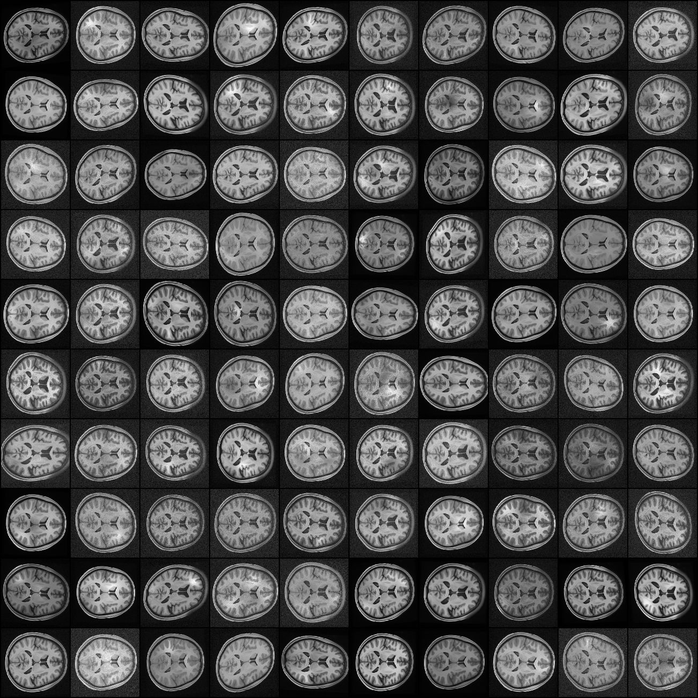
  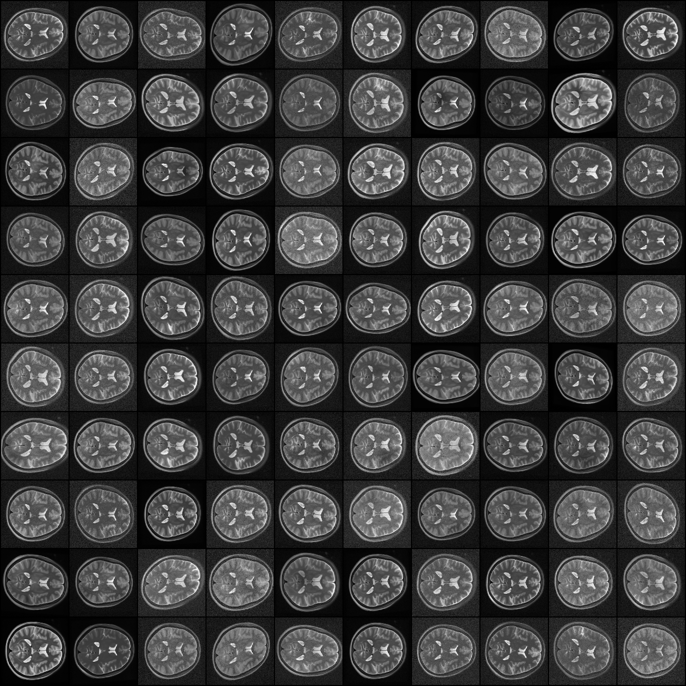
  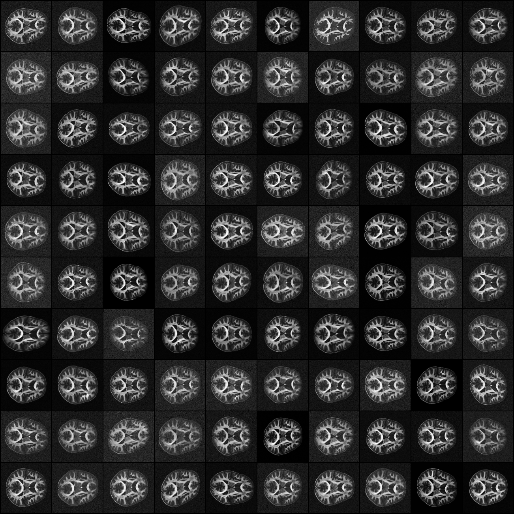
</p>
  
</details>

<details>

<summary>Output:  Generative samples at 120k iterations</summary>

<p align="center">
  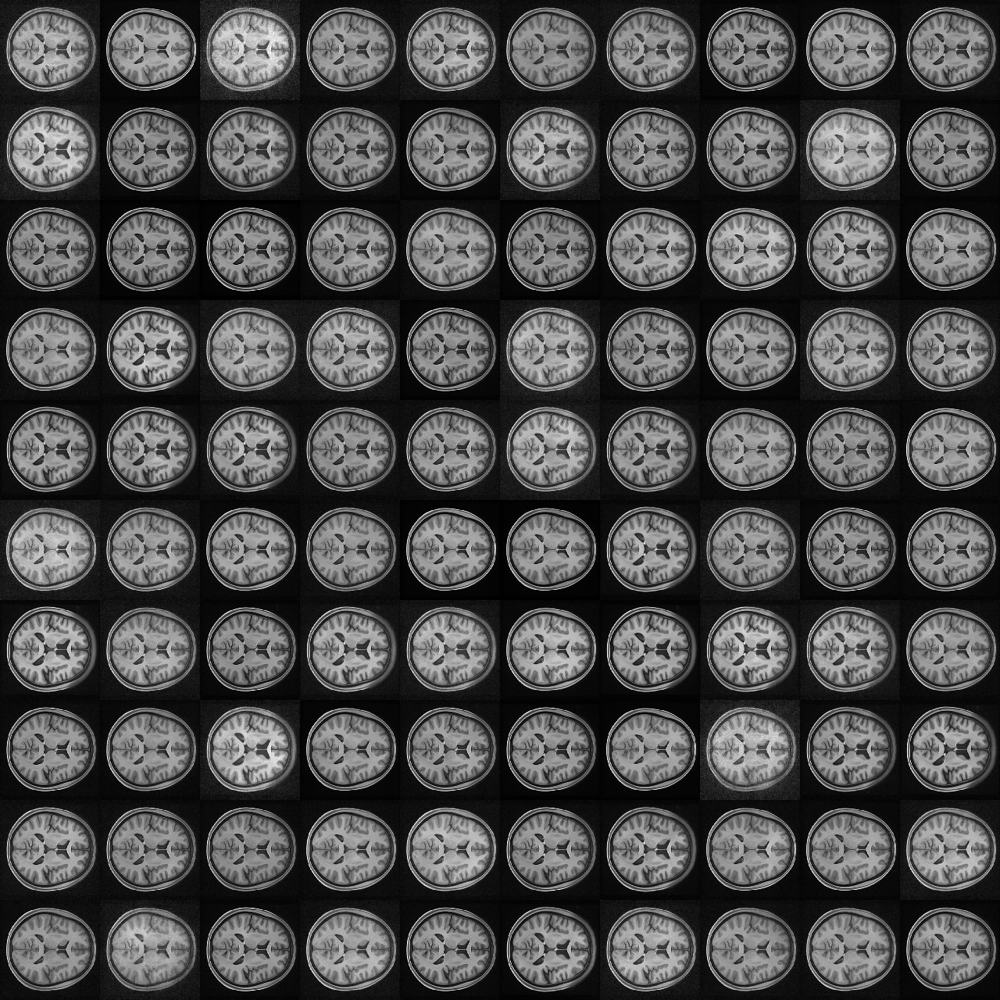
  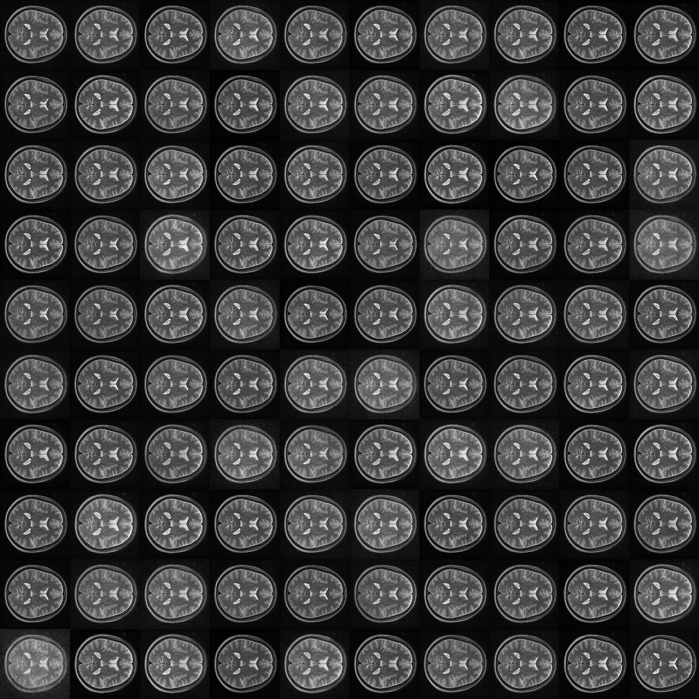
  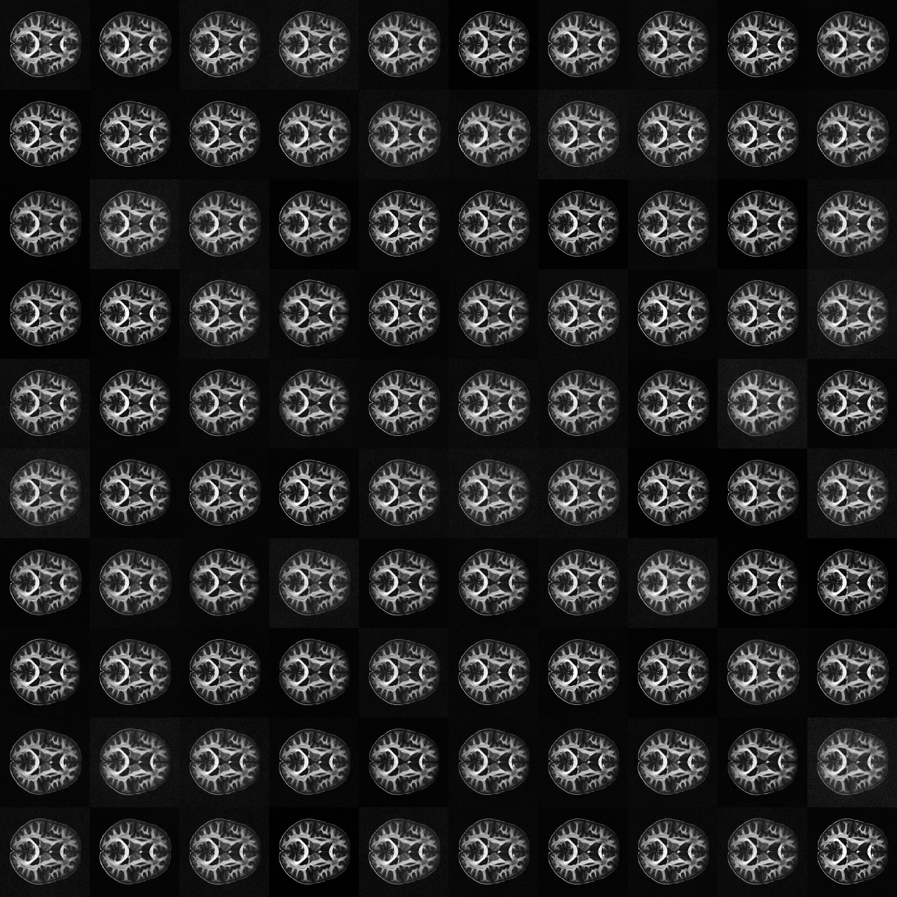
</p>
  
</details>

***

### Funding support

We gratefully acknowledge the grant support of the Office of Naval Research (N0014-23-1-2317)
and the National Institute of Biomedical Imaging and Bioengineering (R01-EB031722).  
  

